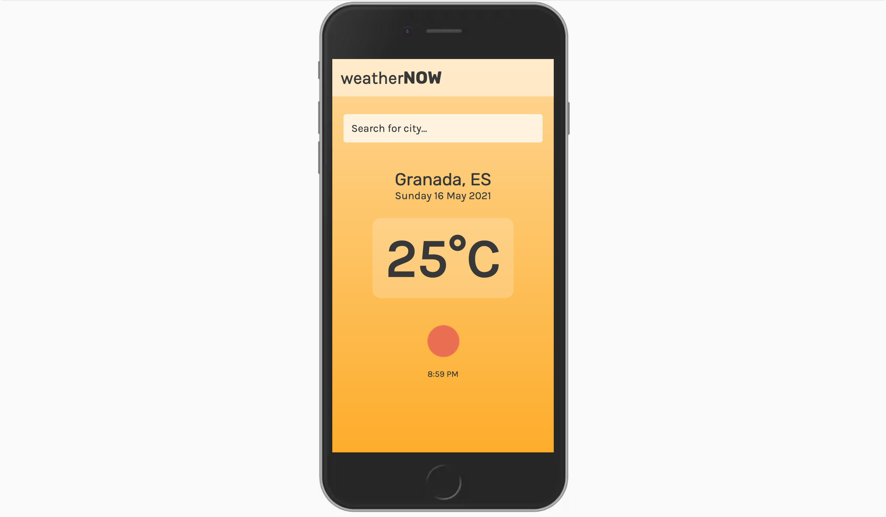

# WeatherNOW

React application that allows users to see the current weather depending on the city that they search for. It uses the OpenWeatherMap API. The background colour changes depending on the temperature. 
You can try the app [here.](https://lucid-payne-0568a7.netlify.app/) 

### Screenshots
   
   
   
   
   
   

### Setup

1. Fork and clone this repository.
2. Install dependencies with `npm install`.
3. Then run `npm start`.
4. Go to `localhost:3000` in your browser.

### Dependencies

- Axios
- Classnames
- Moment
- React
- React-dom
- React-scrips
